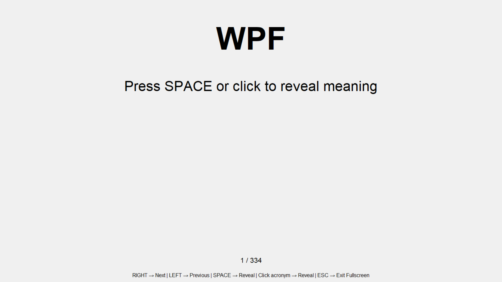
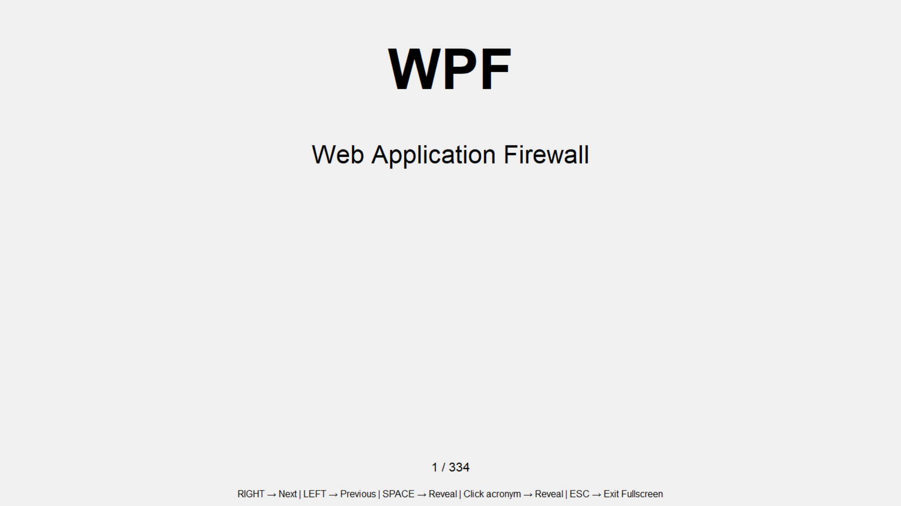
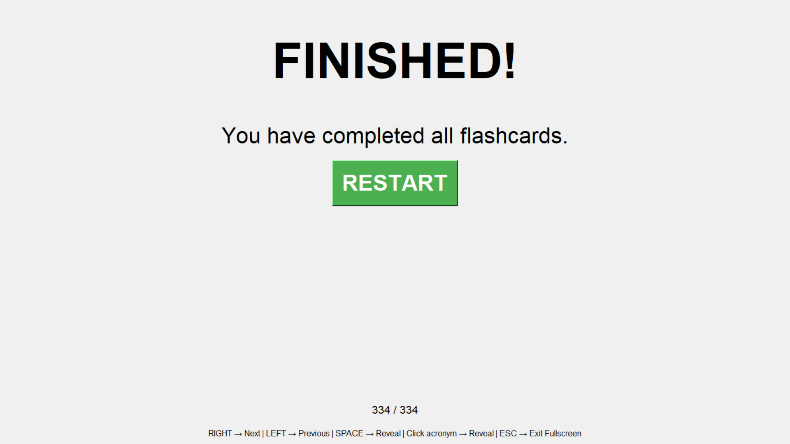

# Acronym Flashcard Generator

A Python Tkinter–based flashcard application designed to help learners efficiently master technical acronyms using active recall instead of passive memorization.

This project addresses a common learning challenge:
memorizing a large number of acronyms quickly and effectively, especially for technical and certification-based studies.

---

# Overview

The Acronym Flashcard Generator provides a distraction-free, fullscreen environment where users can practice acronyms interactively.
Meanings are revealed manually, encouraging active recall, which significantly improves long-term retention.

The application is fully customizable through a simple text file, allowing users to adapt it to any technical domain.

---

## Features

-	Fullscreen, distraction-free user interface
-	Randomized flashcard order for every session
-	Active recall with manual meaning reveal
-	Keyboard-based navigation
-	Mouse click support
-	Progress tracking during sessions
-	Restart option after completing all flashcards
-	Easy customization using a plain .txt file

---

## Screenshots

### Home Screen
This screen displays the flashcard application on launch, showing the acronym ready for interaction.



---

### Flashcard View
This screen shows the active recall process where users reveal the meaning of the acronym manually.



---

### Completion Screen
This screen appears after all flashcards are completed and provides an option to restart the session.



---

## Keyboard Controls

| Key | Action |
|-----|--------|
| SPACE | Reveal acronym meaning |
| Right Arrow (→) | Next flashcard |
| Left Arrow (←) | Previous flashcard |
| ESC | Exit fullscreen |
| F11 | Toggle fullscreen |

You can also click on the acronym to reveal its meaning.

---

## Project Structure

```
acronym-flashcard-generator/
│
├── main.py
├── acronyms.txt
├── README.md
├── requirements.txt
├── .gitignore
└── LICENSE
```
## acronyms.txt Format

Each line in acronyms.txt must follow this structure:

ACRONYM Meaning of the acronym


## Example

```
CIA Central Intelligence Agency
DNS Domain Name System
MITM Man In The Middle
VPN Virtual Private Network
```

## Guidelines

-	Acronym comes first
-	Followed by a space
-	Meaning comes after
-	One acronym per line

No code changes are required when updating this file.

---

## How to Run the Application

### Step 1: Install Python

Ensure Python 3.8 or higher is installed.

Check your version:

python --version

---

### Step 2: Clone the Repository

git clone https://github.com/your-username/acronym-flashcard-generator.git

---

### Step 3: Navigate to the Project Directory

cd acronym-flashcard-generator

---

### Step 4: Run the Application

python main.py

The application will launch in fullscreen mode.

---

## Use Cases

-	CompTIA Security+ exam preparation
-	Cybersecurity fundamentals
-	Networking concepts
-	IT certification studies
-	Learning technical acronyms in any domain

---

## Built With

-	Python
-	Tkinter (GUI framework)

---

## License

This project is licensed under the MIT License.
You are free to use, modify, and distribute this project with proper attribution.

---

## Contribution

This is a learning-focused project.
Feel free to fork the repository and customize it to suit your own study or training requirements.


